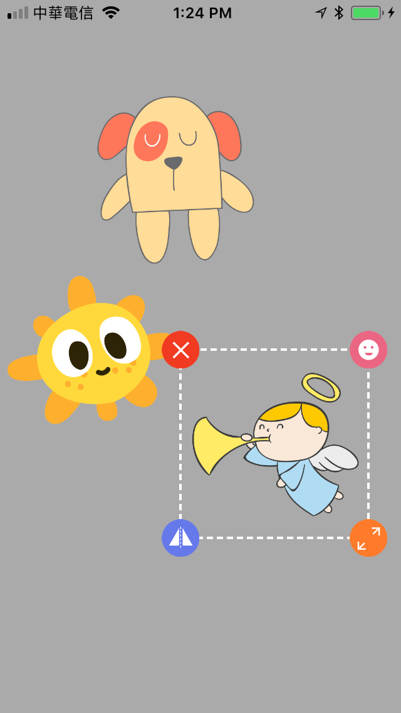
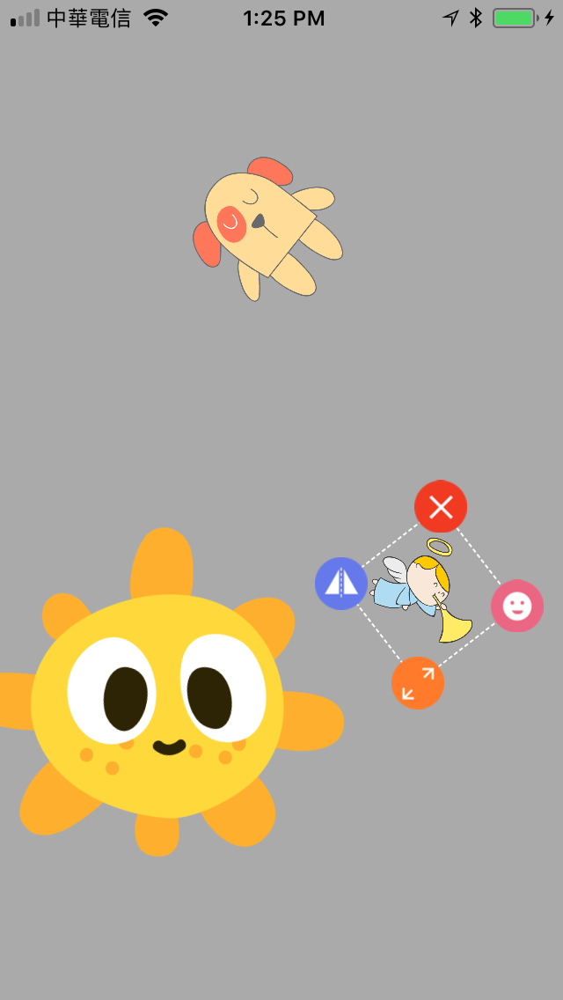

# IRSticker-swift 

- IRSticker-swift is a powerful sticker for iOS.
- See objc version in here: [IRStickerr](https://github.com/irons163/IRSticker).

## Features
- Customize your stickers image.
- Customize your sitcker functions, max to 4.
- Default functions support:
    - Delete
    - Flip
    - Move back to center of main view
    - Scale and move

## Install
### Git
- Git clone this project.
- Copy this project into your own project.
- Add the .xcodeproj into you  project and link it as embed framework.
#### Options
- You can remove the `demo` and `ScreenShots` folder.

### Cocoapods
- Add `pod 'IRSticker-swift'`  in the `Podfile`
- `pod install`

## Usage

### Basic
- Add StickerView.
```swift
import IRSticker_swift

let sticker1 = IRStickerView.init(frame: CGRect.init(x: 0, y: 0, width: 150, height: 150), contentImage: UIImage.init(named: "sticker1.png")!)
sticker1.center = self.view.center
sticker1.enabledControl = false
sticker1.enabledBorder = false
sticker1.tag = 1
sticker1.delegate = self
self.view.addSubview(sticker1)
```

- Use `IRStickerViewDelegate`, see in the demo project.
```swift
public protocol IRStickerViewDelegate: NSObjectProtocol {
    func ir_StickerViewDidTapContentView(stickerView: IRStickerView)

    func ir_StickerView(stickerView: IRStickerView, imageForLeftTopControl recommendedSize: CGSize) -> UIImage?

    func ir_StickerViewDidTapLeftTopControl(stickerView: IRStickerView) // Effective when image is provided.

    func ir_StickerView(stickerView: IRStickerView, imageForRightTopControl recommendedSize: CGSize) -> UIImage?

    func ir_StickerViewDidTapRightTopControl(stickerView: IRStickerView) // Effective when image is provided.

    func ir_StickerView(stickerView: IRStickerView, imageForLeftBottomControl recommendedSize: CGSize) -> UIImage?

    func ir_StickerViewDidTapLeftBottomControl(stickerView: IRStickerView) // Effective when image is provided.

    func ir_StickerView(stickerView: IRStickerView, imageForRightBottomControl recommendedSize: CGSize) -> UIImage?

    func ir_StickerViewDidTapRightBottomControl(stickerView: IRStickerView) // Effective when image is provided.
}
```

## Screenshots
| Stickers | After effections |
|:---:|:---:|
|  |  |

## Copyright
##### This project is inspired from [Single-hand-Sticker](https://github.com/chenkaijie4ever/Single-hand-Sticker).
